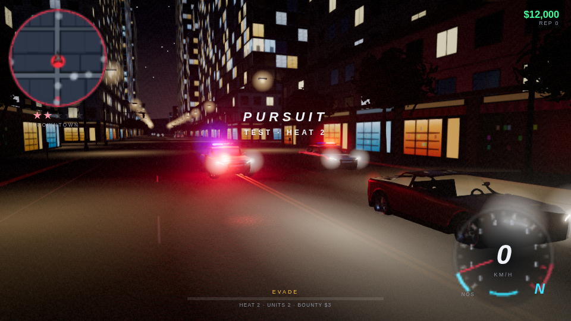
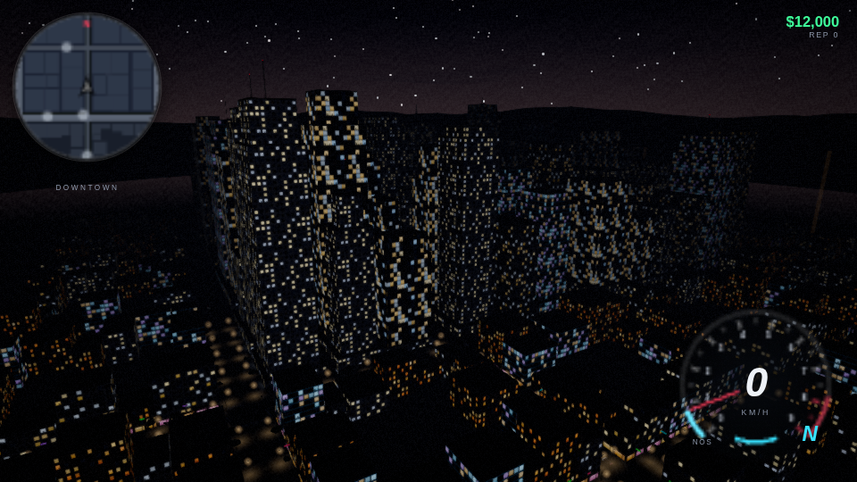
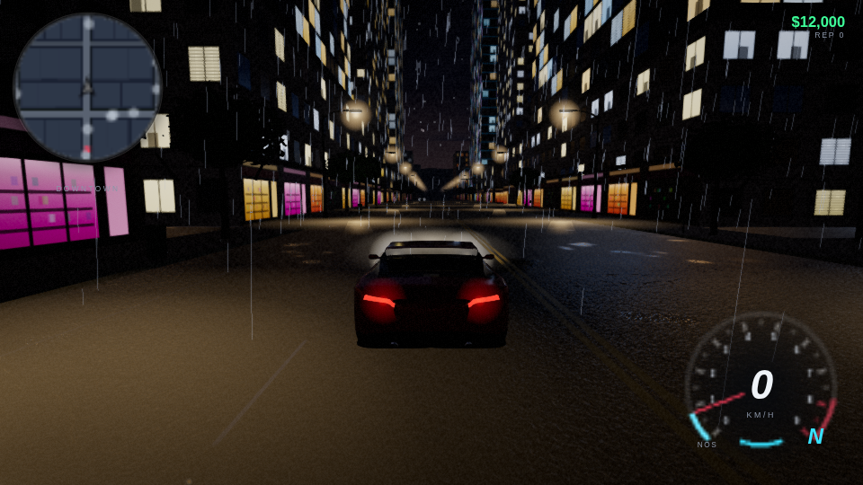
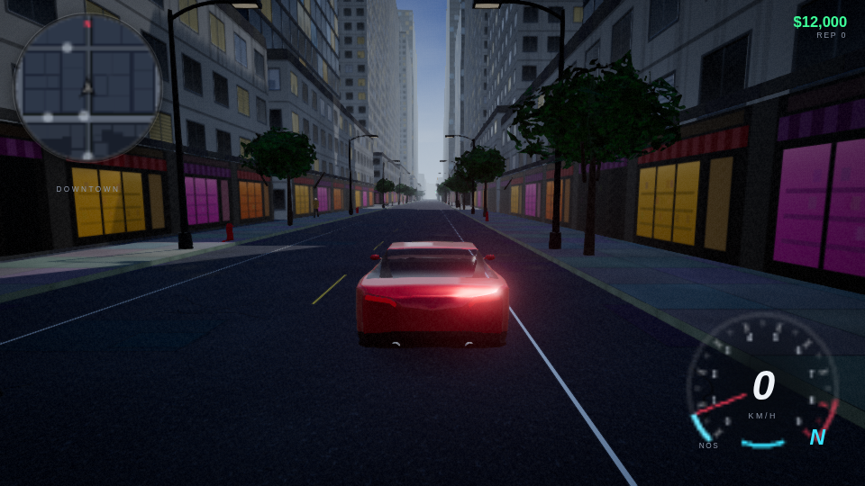
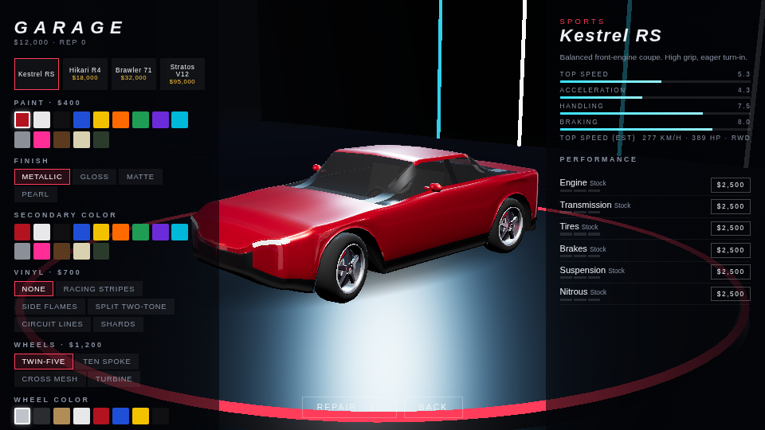

# NIGHTSHIFT

An original open-world night street-racing game that runs in the browser. You drive
through the fictional city of **Port Halvern**: play a GTA-style story, take any car on the
street, enter street races and lose police pursuits.
There is nothing to install for players. They open `http://SERVER_IP:3000` in Chrome, Edge
or Firefox.

- **Engine:** Three.js.
  - The default renderer is WebGL2 (validated).
  - WebGPU can be selected in *Settings → Renderer*. If the WebGPU device fails at runtime,
    the game switches back to WebGL2 by itself.
- **Assets:**
  - The original and traffic vehicles are generated GLB models, built by `tools/generate-models.mjs`.
    The real cars and motorcycles use licensed CC BY 4.0 Sketchfab models converted by
    `tools/import-cars.mjs` (credits are in `public/assets/models/cars/CREDITS.md` and shown in
    the garage).
  - Textures are generated procedurally at the resolution the quality level asks for.
  - Audio is synthesized with the Web Audio API (no samples).
  - Real car names and brands are trademarks of their manufacturers. This is a non-commercial fan
    project; distributing or selling it with them would need the manufacturers' permission.

## Quick start (host)

| Platform | How |
|---|---|
| Windows (easiest) | Run `NIGHTSHIFT_SERVER_SETUP.exe`, then **Start Nightshift Server** (Node is bundled). |
| Windows (source) | Install Node.js 18+ and double-click `start.bat` |
| Linux / macOS | `./start.sh` or `node server.js` |

The server binds to `0.0.0.0:3000` and prints every address players can use:

```
========================================
 NIGHTSHIFT SERVER
========================================
 Server started.
 LOCAL:  http://localhost:3000
 LAN:    http://192.168.1.100:3000
 RADMIN: http://26.x.x.x:3000
 PORT:   3000
========================================
```

To use a different port, run `node server.js --port 8080` or edit `config.json`. The server has
no npm dependencies. For firewall setup, Radmin VPN and troubleshooting, see
[docs/HOSTING.md](docs/HOSTING.md).

To build the Windows installer and portable zip, run `npm install` and then
`npm run installer`. This needs `makensis` and downloads a portable Node runtime. The output
goes to `dist/`.

## Host it online (Render)

The repository has a Render Blueprint (`render.yaml` at the repo root).

1. Sign in at <https://render.com> and connect your GitHub account.
2. **New → Blueprint**, pick this repository, then **Apply**. It creates a free web service that runs
   `node server.js` from the `NIGHTSHIFT` folder on branch `claude/sharp-edison-fm66kb` (change `branch`
   in `render.yaml` if you merge elsewhere). Nothing needs installing; Render provides `PORT`.
3. Open the `https://nightshift-xxxx.onrender.com` address Render shows. Pushes to the branch redeploy.

Free services sleep after ~15 minutes idle, so the first visit afterwards takes 30-60 s to wake up.
Saves live in each player's browser.

## Controls

| Action | Keyboard | Gamepad |
|---|---|---|
| Throttle / brake-reverse | W / S | RT / LT |
| Steer | A / D | Left stick |
| Handbrake (drift) | SPACE | A |
| Nitrous | SHIFT | RB |
| Camera (close, chase, far, bumper, hood, cockpit) | V | R3 |
| Look around / look back | Right-mouse drag / C | Right stick / X |
| Get out of / into a car (any car on the street) | F | Y |
| On foot: walk / sprint / jump | W A S D / SHIFT / SPACE | Left stick / RB / A |
| Start mission, event or rival challenge / enter garage | E (in the marker) | A |
| Map | M | View |
| Instant replay | I | |
| Photo mode | F2 | |
| Reset car | R | LB |
| Pause | ESC | Start |
| Developer stats (FPS, GPU, engine audio model) | F3 | |
| Fullscreen | F11 | |

## Gameplay

- **Story:** a GTA-style campaign in two chapters (12 missions). Mission givers (Tully, Mara
  Voss, Deacon, Rosa Reyes) stand in the city with a coloured marker; walk or drive up and press
  E. Letterboxed cutscenes with subtitles, then objectives: steal and deliver cars, getaways,
  tailing, races, ramming targets off the road, timed pickups and convoy escorts, with phone
  calls, MISSION PASSED / FAILED and retry. Progress shows in *Career* and on the map.
- **On foot:** get out anywhere, walk around, get back in, or carjack any traffic car (sedans,
  SUVs, vans, trucks, buses all drive). Cars you leave stay parked. Police chase you on foot too.
- **Free roam:** the city has downtown, the Market District, Ironworks (industrial), Dockside
  warehouses, Elm Heights (suburbs), a riverside with bridges, a tunnel, a parking deck, a
  construction zone with jumps, and a six-lane ring highway. Day and night follow your real
  local time by default (or a 48-minute game clock, or a fixed time) with dynamic weather.
- **Races and rivals:**
  - Sprint, Circuit, Checkpoint, Speed Run (speed traps), Time Trial and Police Escape events.
  - Street rivals cruise the city: pull up beside one and press E for a one-on-one sprint.
- **Police:**
  - Units patrol, detect you and pursue you; backup, intercepts and roadblocks at heat 4+.
  - Heat runs from 1 to 5. Evading starts a cooldown. Staying slow while surrounded gets you
    **BUSTED**.
- **Cars:** 4 original cars plus 16 real cars (BMW, Subaru, Mazda, Porsche, Nissan, Toyota, Honda,
  Chevrolet, Audi, Ferrari, McLaren, Lamborghini) with physics calibrated to their real 0-100 and
  top speeds and their own engine layouts. They unlock by driver level (1-30) or career missions.
- **Motorcycles:** 7 real bikes: Harley-Davidson Iron 883, Kawasaki Ninja ZX-6R and Ninja H2, Yamaha
  YZF-R1, BMW S 1000 RR, Suzuki Hayabusa and Ducati Panigale V4 R. Each is calibrated to its real
  0-100 and top speed and has its own engine sound (crossplane R1, twin-pulse V4, 45° V-twin).
  Bikes lean into corners, wheelie off the line, and carry a rider posed to the bike (sport crouch
  or cruiser). Parked bikes rest on the side stand. Buy them in the garage with the cars.
- **People:** the player on foot, other players, mission contacts and the pedestrians nearest the
  camera are rigged, textured characters (8 CC BY models, credits in
  `public/assets/models/humans/CREDITS.md`) animated with motion-captured clips (Quaternius'
  CC0 Universal Animation Library, retargeted by `tools/import-anims.mjs`): idle, walk, jog and
  sprint blended by speed, jumps and landings, stumbling when clipped by a car. Getting in and out
  of a car is choreographed: walk to the door, pull it open, step in and sit down; getting out, swing
  the legs out, stand up and push the door shut (move to skip that last part). Every real car's front
  doors open on their hinges (scissor on the Centenario, butterfly on the Senna); the converter cuts
  them out of each model. Bikes carry a rigged helmeted rider. Farther pedestrians use cheap instanced
  figures; how many are realistic depends on the graphics quality.
- **Garage:** paint (incl. factory colours), finish, vinyl, wheels, spoiler, hood, bumper, tint,
  calipers; engine, transmission, tyres, brakes, suspension and nitrous upgrades.
- **Sound:** engines are a physical model (per-cylinder firing through modelled exhaust pipes);
  crashes, scrapes, tyre screech and backfires are rendered from layered impact synthesis.
- **Extras:** instant replay with cinematic cameras, photo mode with filters and PNG export,
  style combos, driver XP and levels, career missions.
- **Graphics:** quality is detected automatically (up to ULTRA on high-end GPUs) and adjusts at
  runtime if the frame rate drops; everything can be overridden in *Settings*.
- **Progress:** everything is saved in the browser (`localStorage`).

## Architecture

```
server.js, server/        zero-dependency static host + WebSocket multiplayer room (server/room.js)
public/                   index.html, CSS, vendored three.js, generated GLB models
src/core/                 Game loop, GameState, Input, Settings, SaveSystem, QualityManager, EventBus
src/renderer/             RendererManager (WebGPU/WebGL2), PostFX, Environment (time/weather/sky),
                          Materials, procedural Textures, Effects (particles, skid marks)
src/world/                CityLayout (road graph, districts), CityPlanner (buildings, props, colliders),
                          ChunkBuilder/ChunkManager (CITY_CHUNK_X_Z streaming), Props (instancing),
                          LightSystem (fake street lighting), Pedestrians
src/physics/              VehiclePhysics (tire model, weight transfer, suspension, drift assist), Collision
src/vehicles/             Vehicle, VehicleRenderer (car / bike wheel rigs, lights, damage, customization),
                          Rider (IK-posed motorcyclist), AIDriver, catalog
src/traffic/              LaneGraph, TrafficManager (IDM, signals, lane changes), TrafficRenderer (instanced)
src/police/ src/races/    PoliceManager, RaceManager, RaceEvents
src/camera/ src/audio/    CameraController, procedural AudioManager
src/ui/                   HUD, minimap/world map (2D), menus, settings, garage
src/networking/           NetworkClient (players, on-foot state, shared parked cars, interpolation, collisions)
tools/                    model generator, installer build scripts
```

### Performance

- **Quality levels:** Very Low, Low, Medium, High and Ultra.
  - On first launch the game picks one automatically from a GPU heuristic plus a short
    benchmark. It never auto-selects Ultra.
  - Every setting can be overridden in Settings.
- **Streaming:** the city streams in 160 m chunks.
  - Near chunks get markings, storefronts, signs and roof detail.
  - Far chunks use cheaper facade materials.
  - Chunks outside the view distance are unloaded.
- **Instancing:** street furniture, traffic cars (per type and material), wheels, pedestrians,
  light pools, halos and particles are all InstancedMeshes, so draw calls stay low.
- **Lighting:** street lighting is faked with additive light pools and wet-road reflection
  streaks. Only the player headlights and a few police lights are real lights.

### Multiplayer

Multiplayer is on by default. Everyone who opens the same server address shares the city (up to
8 players; `multiplayer.maxPlayers` in `config.json`). To play alone on a shared server, start
it with `--no-multiplayer`.

- Other players show up with a name tag and on the minimap: in their car or on their bike, or
  walking when they are on foot. Set your name in *Settings → Multiplayer*.
- Their cars are solid, so you can bump and block each other.
- Get out with F and take any car: traffic, a stopped police cruiser, a street rival's car, or a
  car another player left parked. The server hands a parked car to whoever asks first, and its
  owner gets a message.
- Traffic, police, races and missions are simulated separately by each player.

Protocol: JSON over `/ws`. Clients send their state at 20 Hz: position, rotation, velocity,
vehicle, paint, on-foot flag, parked cars, and a teleport counter for respawns and resets. The
server validates each update (speed is clamped and unannounced jumps over 60 m are rejected),
then broadcasts snapshots at 20 Hz. Clients interpolate the other players 120 ms behind.

## Regenerating models

```sh
npm install        # installs three.js (dev only)
npm run models     # writes public/assets/models/*.glb
```

## Screenshots

These were captured with headless Chromium using software rendering (SwiftShader), so real GPUs will look smoother.






