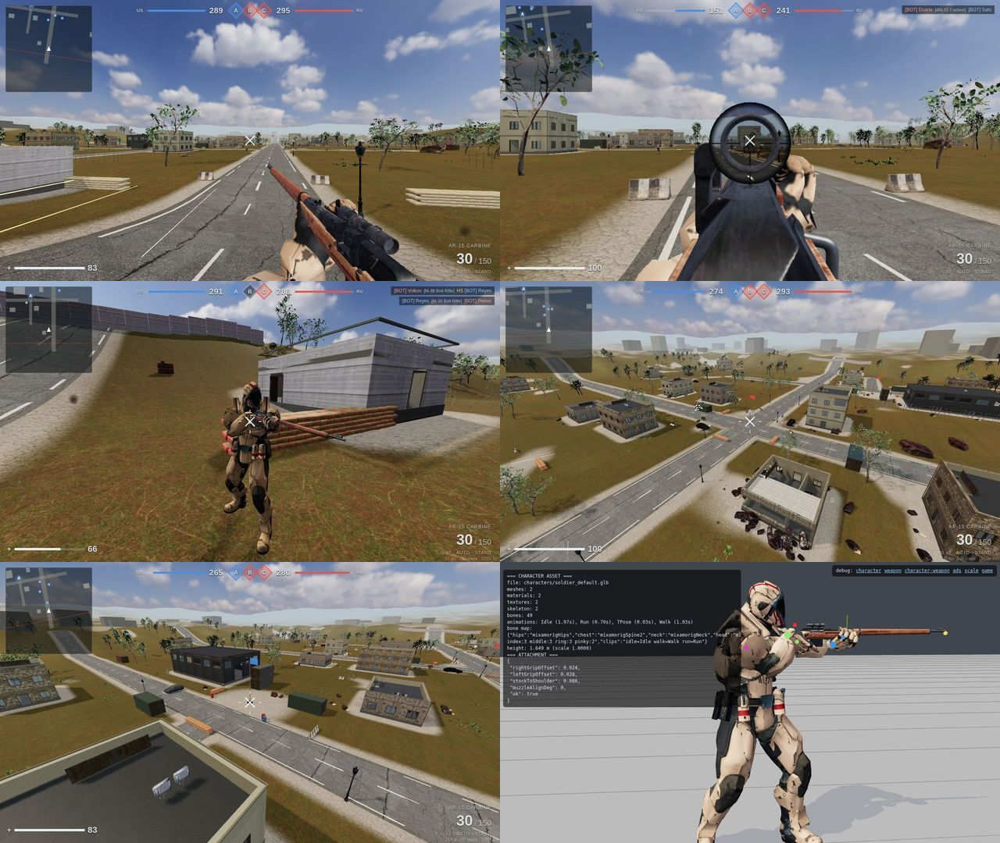

# STRIKEPOINT



A browser-based, realistic-looking modern military FPS in the spirit of large-scale Conquest shooters
(original content — no third-party game assets). Three.js client + Node.js server-authoritative multiplayer,
tuned to run on low-end GPUs.

```
npm install        # installs deps and downloads the default rigged soldier (three.js example asset)
npm start          # http://localhost:3000  (PORT, BOTS=6 per team in the default rooms)
npm run share      # host from your PC and get a public https link for friends anywhere (no account needed)
npm test           # unit + WebSocket integration tests
npm run assets     # (optional) re-download and re-optimize all CC0 source assets into client/assets/
```

## Playing together (rooms)
* **Server browser** lists the public rooms: one always-on room per map (`OUTSKIRTS`, `HARBOR`, `VALLEY`, `ZULU`,
  and the battle royale room `FIRESTORM`) plus any public room players created. Double-click to join.
* **Create room**: pick a map, bots per team (0–16), max players (2–32), optional password, private (hidden from the
  browser) and map rotation. You get a 6-letter **room code**.
* **Invite**: share `https://<your-host>/?room=CODE` — the deploy screen shows the link with a COPY button, or press
  **I** in game. Friends opening the link land on *Join by code* with the code filled in.
* Each room is an independent server-authoritative match (own map, bots, tickets). Empty rooms sleep; private
  rooms close 2 minutes after the last player leaves. With rotation on, the room moves to the next map after each
  round and everyone is carried over automatically.

## Maps
| Map | Size | Flags | Character |
|---|---|---|---|
| **Outskirts** | 336 m | 3 | ruined town crossroads between an industrial yard and a depot, mixed ranges |
| **Harbor Docks** | 300 m | 4 | container terminal on the water: tight container lanes, open quay, warehouse row |
| **Dry Valley** | 384 m | 3 | big hills, winding road, farm, village and fortified hilltop — long sightlines |
| **Checkpoint Zulu** | 184 m | 3 | small walled military compound — fast close-quarters infantry |
| **Firestorm Island** | 840 m | — | **battle royale**: town, villages, farm, industrial yard, military base, radio station, checkpoint |

Maps are plain data in `shared/maps/*.js` (roads, flags, bases, buildings, props, terrain relief, vegetation,
lighting/fog). Server (collision, nav grid, bots) and browser (rendering) generate the same world from it —
add a file there and register it in `shared/map.js` to create a new map.

## Hosting on the internet
| Option | How |
|---|---|
| **Your own PC, instantly** | `npm run share` → prints a public `https://….trycloudflare.com` link (Cloudflare quick tunnel). Works behind routers/NAT; the link lives while the window is open. |
| **Render.com** | Push this repo to GitHub → Render → *New + → Blueprint* → select the repo (`render.yaml`, Docker). |
| **Fly.io** | `fly launch --copy-config --no-deploy && fly deploy` (`fly.toml`). |
| **Any VPS / Docker host** | `docker build -t strikepoint . && docker run -p 80:3000 strikepoint` (put HTTPS in front, e.g. Caddy). |

The client automatically uses `wss://` on HTTPS. Pick a region close to your players: combat is lag-compensated
(the server rewinds targets by each player's ping, up to 250 ms) and remote players are interpolated, so games
across countries stay playable.
Server hardening: per-IP connection cap (`MAX_CONN_PER_IP`, default 8), per-socket message rate limit, room
creation rate limit (5 per 10 min per IP, max 40 rooms), room passwords compared in constant time, sanitised names
and chat, 16 KB max message size, gzip for all text assets.

## Controls
**Phones / tablets (touch, landscape):** left thumb = floating joystick (push to the top rim to sprint) · drag the
right half of the screen to look · hold **FIRE** (drag it to aim while shooting) · **AIM** toggles sights ·
JUMP / CRCH / PRONE / R (reload) / G (grenade) / ⇄ (swap weapon) · top: 👁 third person, ☰ scoreboard, 💬 chat,
❚❚ pause (look sensitivity, invite link, leave room). Deploying goes fullscreen + landscape. Force touch UI on any
device with `?touch=1`.

**Keyboard & mouse:** WASD move · Shift sprint · Space jump · C crouch · Z prone · RMB aim down sights · LMB fire · R reload ·
1/2 or wheel switch weapon · G grenade · **V first/third person** · Tab scoreboard · T/Enter chat · F3 asset debug ·
battle royale: **Space** jump / open parachute · **E** pick up · **H** heal · **M** island map

## Game
* **Conquest**: flags A / B / C, capture by standing in the zone (more soldiers = faster), 300 tickets per team,
  each death costs a ticket, holding more flags bleeds the enemy. Round restarts 15 s after a team hits 0.
* **Battle royale** (Firestorm Island, room `FIRESTORM` or create a room on that map):
  1. **Warm-up** — the match starts 25 s after the first player joins (bots fill the lobby; `ROYALE_BOTS`, `ROYALE_LOBBY`).
  2. **Transport plane** flies a random line across the island (chase camera, flight path on the island map).
     **SPACE / JUMP** to jump once it is over land; anyone still aboard is thrown out at the far coast.
  3. **Freefall** (look down to dive, steer with WASD/stick) → **SPACE** opens the ram-air **parachute**
     (auto-opens at 55 m).
  4. Everyone lands with a pistol and no spare ammo. **Loot** lies inside every building and next to crates, containers
     and wrecks: AR-15, bolt rifle, pistol, ammo boxes, **armor plate kits** (absorb 60 % of hits, 100 max),
     **med kits** (**H**: 3.2 s, +50 HP) and frag grenades. **E** / PICK picks up (swapping drops your old weapon).
  5. The **ring of fire** closes in five stages (wall of flames, 1.5 → 12 HP/s outside); the next safe zone is shown on
     the minimap and on the island map (**M**). **Supply drops** parachute into the next zone (red smoke) with rifles,
     armor and med kits.
  6. **No respawns** — fallen soldiers drop everything they carried; you get your placement and spectate the survivors.
     Last one standing wins, then the next match starts in the same room.
  Everything is server-authoritative (jump window, air-speed limits, pickup range, armor, healing, ring damage).
  Royale bots pick a drop zone along the flight path, loot what they need, run from the ring and fight everyone.
* **Kits**: Assault (automatic carbine, pistol, 2 frags) · Recon (4× scoped bolt-action rifle, pistol, 1 frag).
* **Server-authoritative**: the server owns ammo, fire rate, damage, hit detection (lag-compensated hitscan
  against capsule hitboxes; walls/cover block shots; headshot multipliers; range falloff), grenades (simulated
  bounce + line-of-sight blast), capture, tickets, respawn, chat rate limiting and movement sanity checks.
* **Bots**: A* navigation over a nav grid built from the collision world, objective selection, line-of-sight
  perception, reaction time, converging aim error, burst fire, stance changes, grenades.

## Visual architecture (asset-driven — no primitive soldiers/guns)
| Layer | File |
|---|---|
| Asset manifest (candidate files, sockets, overrides) | `client/assets/asset-manifest.json` |
| Asset manager (GLTFLoader, cache, SkeletonUtils clone, HDRI, texture sets, **loud missing-asset errors**) | `client/js/core/AssetManager.js` |
| Weapon normalization + sockets (rightGrip, leftGrip, stock, muzzle, opticEye) + real optic glass/reticle | `client/js/weapons/WeaponModel.js` |
| Skeleton discovery / bone + clip mapping | `client/js/character/BoneMap.js` |
| Character rig: anim blending, speed-synced locomotion, crouch via leg IK, prone, death, aim spine, head look, stock-to-shoulder, **two-bone arm IK to the weapon grips**, finger curl, alignment validation | `client/js/character/CharacterRig.js`, `IK.js` |
| First-person viewmodel (same character arms + weapon), hip↔ADS interpolation to the optic eye point, scope picture-in-picture with reticle, sway/bob/recoil/reload/switch | `client/js/player/Viewmodel.js` |
| World: PBR splat terrain + outer landscape, roads, modular buildings with interiors & stairs, instanced props, vegetation LOD0/LOD1/impostors + streamed grass, flags, skyline | `client/js/world/*` |
| Lighting: HDRI IBL + sky, sun with texel-snapped soft shadows, hemisphere fill, fog, ACES | `client/js/render/Renderer.js` |
| Effects (pooled particles, tracers, decals, per-surface impacts, explosions, smoke) · spatial audio (**recorded CC0 gunshots** with per-shot variation, distance muffling, speed-of-sound delay; synthesized foley) · HUD | `client/js/fx`, `client/js/audio`, `client/js/ui` |

### Debug scenes
`/debug/character`, `/debug/weapon?w=bolt_rifle`, `/debug/character-weapon?view=side`, `/debug/ads?w=bolt_rifle`,
`/debug/scale` — isolated renders of the real assets with socket markers (green = right grip, blue = left grip,
magenta = stock, yellow = muzzle, red = optic eye) and an attachment report
(`rightGripOffset`, `leftGripOffset`, `stockToShoulder`, `muzzleAlignDeg`). Asset diagnostics (meshes, materials,
textures, skeletons, bones, animations, nodes) are printed to the browser console.

### Using your own models
Put GLBs in `client/assets/user/` (see the README there) — e.g. `characters/soldier.glb`,
`characters/fsb_operator.glb`, `weapons/ss2_v5_assault_rifle.glb`. They override the defaults automatically;
if a file listed nowhere can be found the game logs `FAILED TO LOAD …` instead of silently drawing primitives.
Convert your own `.blend` files with `blender -b file.blend --python scripts/blend2glb.py -- out.glb`.

### Default assets & licenses
* Props, weapons (bolt-action rifle with PU-style scope, service pistol, grenade), trees, grass, shrubs, rocks,
  PBR textures and the sky HDRI: **Poly Haven, CC0** — fetched and optimized by `scripts/build-assets.mjs`
  (meshoptimizer simplification, foliage thinning, opacity-map baking, WebP textures).
* Default soldier: three.js example `Soldier.glb` (Mixamo) — downloaded at install time, not redistributed.
* Gunshots: real recordings from *The Free Firearm Sound Library* (OpenGameArt, **CC0**) — see
  `client/assets/audio/README.md`.

### Performance (VERY LOW / LOW / MEDIUM presets)
Instanced props/vegetation, tree LOD0 → LOD1 → baked billboard impostors, distance-streamed grass, chunked
terrain with frustum culling, shared materials/texture sets, single shared GLB per asset with skeleton-aware
cloning, pooled particles/decals/tracers.
* **Dynamic resolution**: the render scale drops automatically when frames take longer than ~22 ms and recovers
  when there is headroom (the FPS counter shows the current `res %`).
* **Shadows**: texel-snapped cascade around the camera, re-rendered only every 2nd (MEDIUM) / 3rd (LOW) frame;
  VERY LOW has no shadow pass, no grass and shorter fog/draw distance (default on phones).
* **Soldiers**: frustum-culled animation (off-screen = 4 Hz), distance-based animation rate, finger IK only up close.
* **No hitches**: all shaders are compiled during loading; the camera far plane ends at the fog; minimap at 12 Hz.
* **Network**: adaptive interpolation buffer (grows with measured jitter), 20 Hz snapshots.
* `?perf=1` shows per-system CPU time per frame (also `window.__perf`).

### Playtest
`npm run playtest:royale` (server running with `DEV_TELEPORT=1 ROYALE_LOBBY=50`) plays a battle royale match in a real
browser: lobby, plane, jump, freefall, parachute, landing, loot pickup, armor, island map, death, placement, spectating.
`npm run playtest:mobile -- <map>` does the same on an emulated phone with real multi-touch events (24 checks).
`npm run playtest -- <map>` (server running with `DEV_TELEPORT=1 BOTS=0`) drives a real browser client plus a second
network client through ~30 checks: movement, stances, jump, weapon switch, ADS + firing with server damage, reload, kill,
kill feed/score, death/deploy/respawn, grenade, chat, third person, scoreboard.

### Visual test tooling
`scripts/shot.mjs` (debug scenes) and `scripts/gameshot.mjs` (scripted in-game camera tour, run the server with
`DEV_TELEPORT=1`) capture screenshots with headless Chromium; `docs/screenshots/` holds the latest captures.
